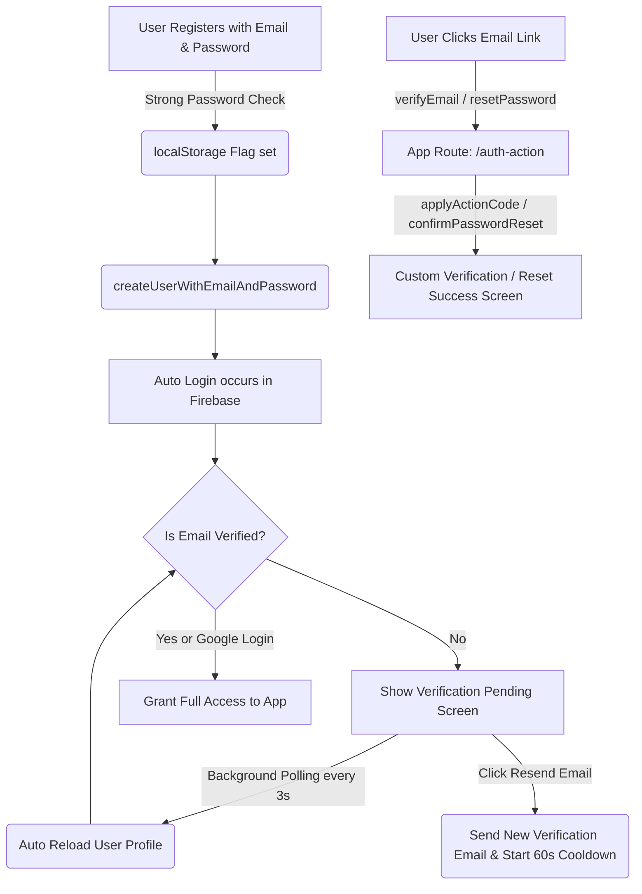

# Welcome to My StreamIt Webapp

## Project info


If you want to work locally using your own IDE, you can clone this repo and push changes. Pushed changes will also be reflected in Lovable.

The only requirement is having Node.js & npm installed - [install with nvm](https://github.com/nvm-sh/nvm#installing-and-updating)

Follow these steps:

```sh
# Step 1: Clone the repository using the project's Git URL.
git clone <YOUR_GIT_URL>

# Step 2: Navigate to the project directory.
cd <YOUR_PROJECT_NAME>

# Step 3: Install the necessary dependencies.
npm i

# Step 4: Start the development server with auto-reloading and an instant preview.
npm run dev
```


## 🛠️ Unified Security & Action Workflow



---


## 🔐 Firebase Console Configuration Checklist

To configure Firebase so it routes your email links to this beautiful new action handler:

### 1. Update the Email Templates Action URL
1. Go to the [Firebase Console](https://console.firebase.google.com/).
2. Select your project: **`streamke-bcb5a`**.
3. Navigate to **Authentication** ➔ **Templates** tab.
4. Click on **Email address verification** (or **Password reset**), and click the edit icon.
5. Click **Customize Action URL** at the bottom:
   - Change the Action URL to your production domain or local test URL:
     `https://streamke-bcb5a.firebaseapp.com/auth-action`
     *(Note: Firebase also lets you use your own Vercel or custom domain if configured)*.
6. Click **Save** to apply!

---

## 🌟 Visual Preview of Security Upgrades

| Feature | Design Highlights |
| :--- | :--- |
| **Real-time Password Strength** | A list of requirements that toggle from grey to green with active bubble icons as you type. |
| **Forgot Password form** | Transparent glass pane, unified email search validation, loading spinners, and fade-in recovery notices. |
| **Custom landing card** | Verification status check animation, secure action handling, instant login redirects. |

> [!TIP]
> **Password reset security:** The password reset flow on the custom action page ensures that users cannot set a weak password when recovering their account, keeping the entire platform 100% secure from end-to-end.

**Edit a file directly in GitHub**

- Navigate to the desired file(s).
- Click the "Edit" button (pencil icon) at the top right of the file view.
- Make your changes and commit the changes.

**Use GitHub Codespaces**

- Navigate to the main page of your repository.
- Click on the "Code" button (green button) near the top right.
- Select the "Codespaces" tab.
- Click on "New codespace" to launch a new Codespace environment.
- Edit files directly within the Codespace and commit and push your changes once you're done.

## What technologies are used for this project?

This project is built with:

- Vite
- TypeScript
- React
- shadcn-ui
- Tailwind CSS


